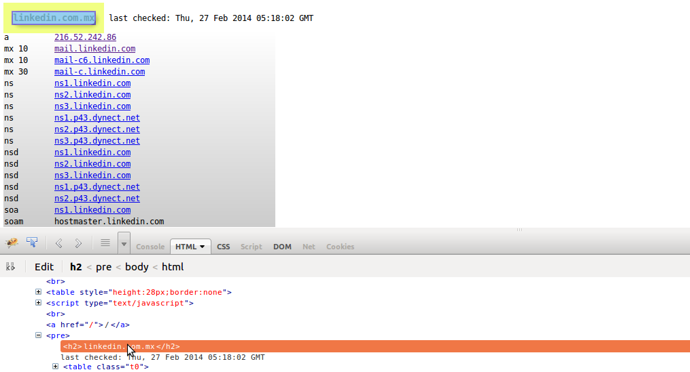

##Web请求

这篇文章将会演示如何使用python进行web请求，这里需要几个python的模块来使得我们能够更容易创建和解析web请求与响应(httplib,Mechanize,Beautiful Soup和urllib/urllib2),安装这些模块并且检查这些功能函数.

**创建一个Web请求**

下面有个简短的例子，展示了使用python的SimpleHTTPServer创建一个本地web服务器，并且建立一个请求:


**解析HTML**

现在我们已经使用Python建立了一个web请求，现在我们要找一个模块来解析HTML文件。而前面我们提到了BeautifulSoup模块能够帮助我们基于HTML标签解析HTML。下面有一个例子，可以帮助你理解如何去解析HTML文件:


BeautifulSoup对于帮助我们解析HTML非常强大，例如你可以使用BeautifulSoup内部的函数"find_all"去查找你想要解析的内容。例如:"iframes = parsed.find_all(‘iframe’)".

**实战写一个应用**

大家都知道，我们可以使用大量的查询去获取更多的web资源，在这里，Python脚本能够自动帮你完成你的查询并且获取到你想要的资源.我常常使用iplist.net去反查域名，看看到底有多少个域名指向了一个IP.

当你开始写脚本的时候，你首先得先考虑两件事情:

1、请求URL的连接结构
２、你想要什么信息？你可以通过HTML标签定位到你想要的数据部分，当然为更加准确，你也可以使用正则式去匹配.

iplist.net的结构相对简单"http://iplist.net/<ip>/",因为我们能够相对比较容易的从一个文件里面使用循环把所有的IP都读取出来，下一步就是查看源代码，看看你最想要的是那个部分的内容，在这个例子中我们可以看到HTML标签header里面有一行```<h2>domain_name</h2>```.

那么我们就使用BeautifulSoup去分离这个页面的源码，下面是执行脚本的过程，我们这里只提取域名并且打印到STDOUT:


FireBug是一个分析源代码的工具，很强加，下面你就可以看到高亮的代码就是我们需要的信息;




说到这里，这篇文章就已经就已经完成了，对于web请求你可以去分析python究竟是如何去请求的，并且如何去提取自己有用的信息并且打印到STDOUT.这里有一个解析iplist.net比较复杂的[脚本](https://github.com/primalsecn/python_code/blob/master/iplist.py)，里面有非常完整的解析原理。大家可以看看