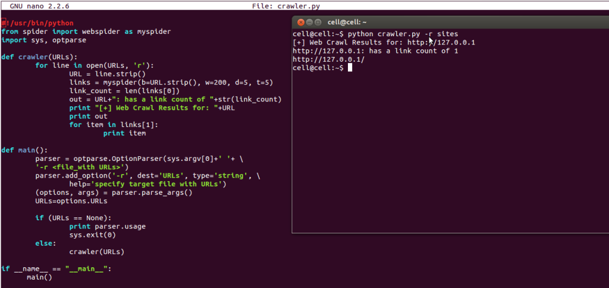

##爬虫

这一章将会介绍使用一些新的模块(optparse,spider)去完成一个爬虫的web应用。爬虫其实就是一个枚举出一个网站上面的所有链接，以帮助你创建一个网站地图的web应用程序。而使用Python则可以很快的帮助你开发出一个爬虫脚本.

你可以创建一个爬虫脚本通过href标签对请求的响应内容进行解析，并且可以在解析的同时创建一个新的请求，你还可以直接调用spider模块来实现，这样就不需要自己去写那样多的代码了:


这里有几个参数你需要去了解一下，不然上面这段脚本是无法成功运行的:"myspider(b=URL.strip(), w=200, d=5, t=5)"这个函数将会返回两个列表:子url链接与路径。你也可以自己修改myspider函数里面的参数:

b — 基本的web URL(默认: 无)
w — 抓取的数量 (默认: 200)
d — 抓取的深度层级 (默认: 5)
t — 设置线程数 (默认: 无)

这篇文章主要是先介绍一个web爬虫的入门基础，web资源千变万化。所以未来在博客的其他文章里面再深入的讲述攻击web服务器一些更高级的案例;

图中的python爬虫脚本代码片段:
```
#!/usr/bin/python
from spider import webspider as myspider
import sys, optparse
 
def crawler(URLs):
        for line in open(URLs, 'r'):
                URL = line.strip()
                links = myspider(b=URL.strip(), w=200, d=5, t=5)
                link_count = len(links[0])
                out = URL+": has a link count of "+str(link_count)
                print "[+] Web Crawl Results for: "+URL
                print out
                for item in links[1]:
                        print item
 
def main():
# optparse模块允许你通过参数选项来调用那段代码
# 这里我使用 '-r'选项并且内容会保存在URLs变量里面
# 当使用-r参数的使用脚本会去读取指定的文件夹
        parser = optparse.OptionParser(sys.argv[0]+' '+ \
        '-r <file_with URLs>')
        parser.add_option('-r', dest='URLs', type='string', \
                help='specify target file with URLs')
        (options, args) = parser.parse_args()
        URLs=options.URLs
 
        if (URLs == None):
                print parser.usage
                sys.exit(0)
        else:
                crawler(URLs)
 
if __name__ == "__main__":
      main()
```
* [spider模块](https://pypi.python.org/pypi/spider.py/)